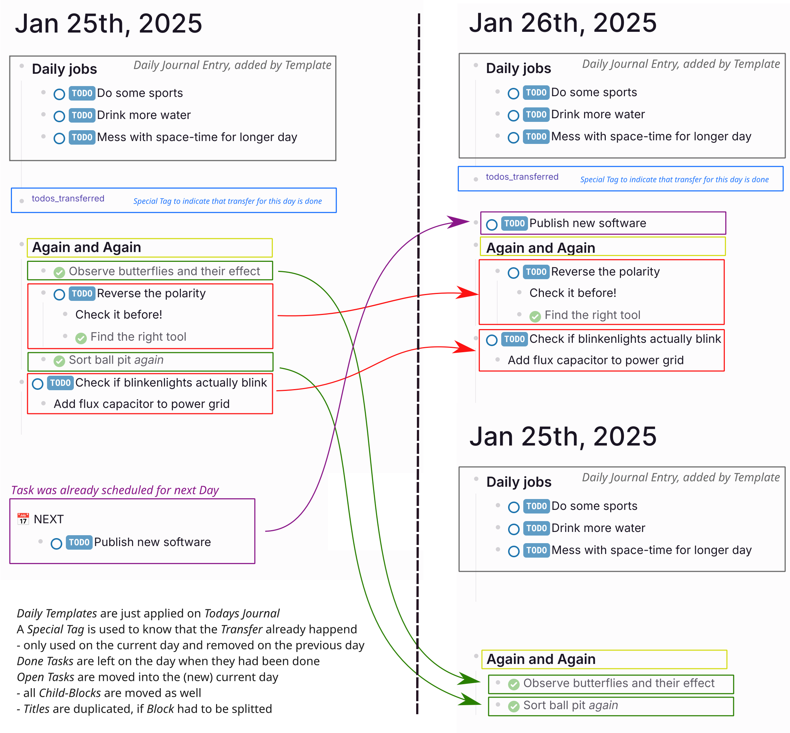

# LogSeq "Transfer undone TODOs" plugin

This plugin has two functions:
* Every time a new journal is created - it moves all the unfinished tasks from the last journal to the new journal
  * it keeps the tree's information structure valid, probably doubling parent nodes
* Calls a Template only once for each day and only when journal is the one of the current day
  * this way you can use daily templates and the agenda to plan your future jobs
 
You can find similar plugins at
  * https://github.com/ehudhala/logseq-plugin-daily-todo and
  * https://github.com/alecdibble/logseq-journal-auto-copier
 
But both of these don't work well when using daily templates or if you like to schedule tasks on future dates as well.

Please note: this plugin is very specific to how I manage tasks in LogSeq, and the code is still in an experimental but working state.
Suggestions and improvements are welcome.

## Usage

Just install and enable it and it works :) Some things might be good to know:
  * Contrary to other similar plugins this plugin will constantly, by default every 60 seconds, check if Today's Journal page was already handled by it. If not, all open TODOs from the day before are transferred into the current Journal. If the day changes, Today's Journal will have no such indication and gets updated as well.
    * there is some 'magic' string used to indicate that a page was updated. By default, \[\^todos_transferred\] is put somewhere on Today's Journal, as long as it's there nothing happens. Just ignore this string while editing, it's small and probably won't bother you. You can choose to use some hidden comment as indication. You won't see it if you look on this page, but you might accidentally try to edit this block - don't. Or your page might get updated again. Play with it and you will know what I mean.
    * there is some 'magic' string which can be used to prevent taking over undone tasks from the previous day. I am using this in my daily template, to prevent doubling daily jobs if they had not been done on the previous day. I am using some comment like "#+BEGIN_COMMENT\ndont_transfer\n#+END_COMMENT" in my daily template TODOs (on every single TODO line), but you can use whatever you like there, as long as it's matching the 'magic' string.
    * if you had configured a daily template with some entry in your "config.edn" (like {:journals "Journal"}), just remove it again and add it in your plugin configuration. Now this template only gets applied to the current day's Journal, not if you preview some future day. Try it, you can now plan things in your future without messing up your Journals. 

## Building yourself

  * pnpm install  // will download required libraries
  * pnpm build    // will check the software
  * pnpm prod     // will produce release files

## Installation

### Install plugins from Marketplace (recommended)

  * enable Plugin usage in LogSeq preferences
  * open Plugin page and search Marketplace for the "Transfer undone TODOs" plugin
  * install and best configure the Plugin.

### Install plugins manually

* Download released version assets from Github.
* Unzip it.
* Click `Load unpacked plugin`, and select destination directory to the unzipped folder.

## References

The plugin skeleton and a lot of of the features are copy/pasted from
  * https://github.com/ehudhala/logseq-plugin-daily-todo
  * https://github.com/YU000jp/logseq-plugin-weekdays-and-weekends
  * https://github.com/alecdibble/logseq-journal-auto-copier
  * https://github.com/vipzhicheng/logseq-plugin-move-block

The Icon was retrieved from https://icon-library.com/icon/todo-icon-27.html.html>Todo Icon # 395663
 

